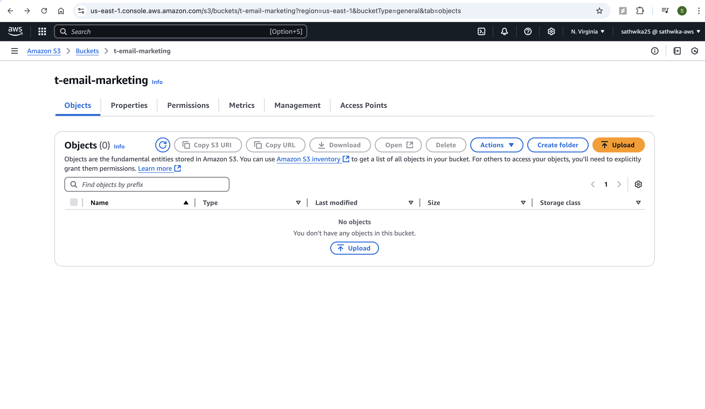
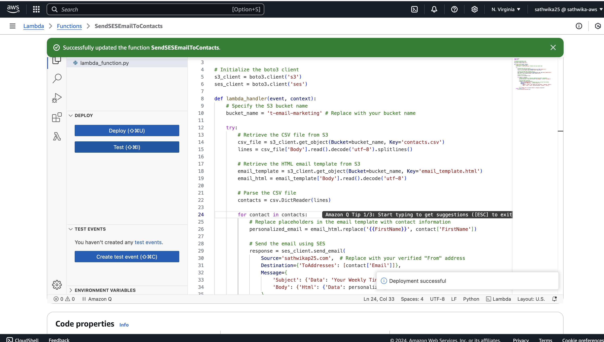
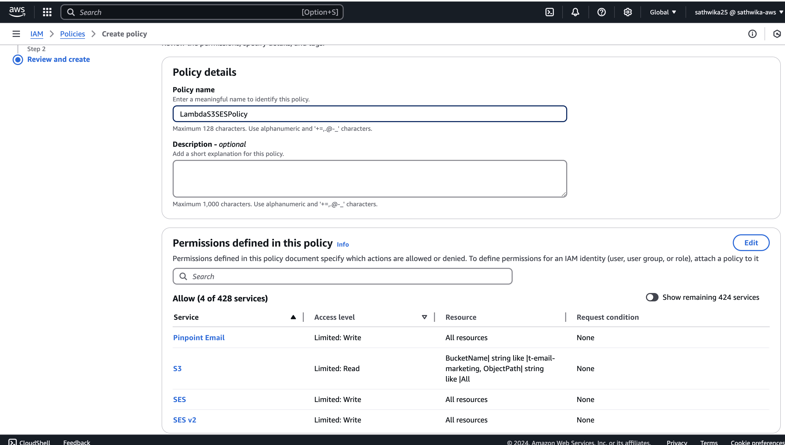
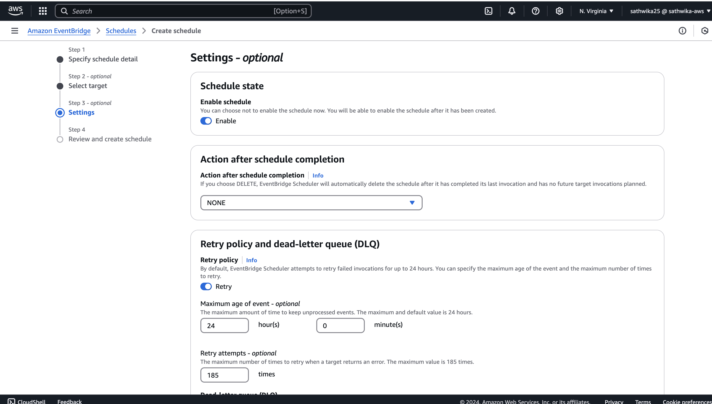
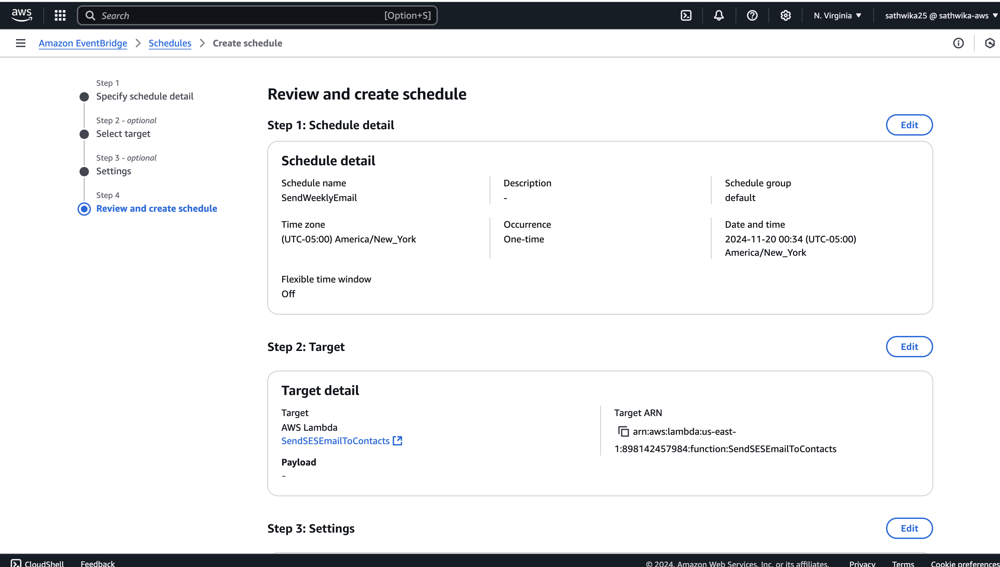

# Serverless-Email-Marketing-Application
This guide explains how to set up a process to send emails using AWS S3, SES, and Lambda with a scheduled trigger using EventBridge.


# Sending Emails Using AWS S3, SES, and Lambda

This guide explains how to set up a process to send emails using AWS S3, SES, and Lambda with a scheduled trigger using EventBridge.

---

## Steps to Set Up

### Step 1: Create an S3 Bucket and Upload Files
1. Navigate to the **S3 Console**.
2. Create a bucket with a globally unique name (e.g., `t-email-marketing`).
   - Ensure **Block Public Access** is enabled (default and recommended for security).


3. Upload the following files into the bucket:
   - `email_template.html`
   - `contacts.csv` (list of contact details)


---

### Step 2: Configure Amazon SES
1. Open the **SES Console** and set up your environment:
   - Configure a sandbox if you are new.
   - Add and verify an email identity for sending emails.

2. Go to **Identities** under **Configuration** and:
   - Add recipient email addresses (e.g., `example1@gmail.com` and `example2@gmail.com`).
   - Verify these emails by clicking on the link sent to them.


---

### Step 3: Create a Lambda Function

1. Navigate to the **Lambda Console** and create a new function:
   - **Name**: `SendSESEmailToContacts`
   - **Runtime**: Python 3.x

2. Paste the following code into the editor:
   ```python
   import boto3
   import csv

   # Initialize the boto3 client
   s3_client = boto3.client('s3')
   ses_client = boto3.client('ses')

   def lambda_handler(event, context):
       # Specify the S3 bucket name
       bucket_name = 't-email-marketing'  # Replace with your bucket name

       try:
           # Retrieve the CSV file from S3
           csv_file = s3_client.get_object(Bucket=bucket_name, Key='contacts.csv')
           lines = csv_file['Body'].read().decode('utf-8').splitlines()
           
           # Retrieve the HTML email template from S3
           email_template = s3_client.get_object(Bucket=bucket_name, Key='email_template.html')
           email_html = email_template['Body'].read().decode('utf-8')
           
           # Parse the CSV file
           contacts = csv.DictReader(lines)
           
           for contact in contacts:
               # Replace placeholders in the email template with contact information
               personalized_email = email_html.replace('{{FirstName}}', contact['FirstName'])
               
               # Send the email using SES
               response = ses_client.send_email(
                   Source='you@yourdomainname.com',  # Replace with your verified "From" address
                   Destination={'ToAddresses': [contact['Email']]},
                   Message={
                       'Subject': {'Data': 'Your Weekly Tiny Tales Mail!', 'Charset': 'UTF-8'},
                       'Body': {'Html': {'Data': personalized_email, 'Charset': 'UTF-8'}}
                   }
               )
               print(f"Email sent to {contact['Email']}: Response {response}")
       except Exception as e:
           print(f"An error occurred: {e}")



Replace your-bucket-name and your-verified-email@example.com with your actual bucket name and source SES verified email.

3. Deploy the function and create a test event (e.g., TestSendEmail).


4. Run the test. If an error occurs, it is likely due to insufficient permissions.


### Step 4: Add IAM Permissions for Lambda

1. Under Execution Role, locate the role associated with your Lambda function (e.g., SendSESEmailToContacts-role-22j4ztrm) and click on it.

2. This opens the IAM Console. You will see that only CloudWatch permissions are assigned by default.

4. Create a new IAM policy:
Go to Policies in the IAM Console and click Create Policy.
Paste the following JSON into the policy editor:
   ```json
   {
       "Version": "2012-10-17",
       "Statement": [
           {
               "Effect": "Allow",
               "Action": ["s3:GetObject"],
               "Resource": "arn:aws:s3:::your-bucket-name/*"
           },
           {
               "Effect": "Allow",
               "Action": ["ses:SendEmail", "ses:SendRawEmail"],
               "Resource": "*"
           }
       ]
   }

Replace your-bucket-name with your actual S3 bucket name.




4. Attach this new policy to your Lambda function's Execution Role.


5. Test the Lambda function to ensure it runs without errors.


### Step 5: Schedule Lambda with EventBridge

1. Go to the **EventBridge Console** and create a new schedule:
   - **Name**: `SendWeeklyEmail2`
   - **Schedule Pattern**: Choose either a **one-time** or **recurring** schedule.
 

2. Set the **Target** to invoke your Lambda function `SendSESEmailToContacts`.


 
4. Review and confirm the schedule.


---
5. You will receive the following mail at your scheduled time based on the given email template.

## Monitoring and Debugging

- Use the **Monitor** tab in the **Lambda Console** to view execution logs.
- Check **CloudWatch Logs** for troubleshooting and insights.


---

## Conclusion

By following these steps, you can automate email delivery using **AWS S3**, **SES**, and **Lambda** with minimal setup.


